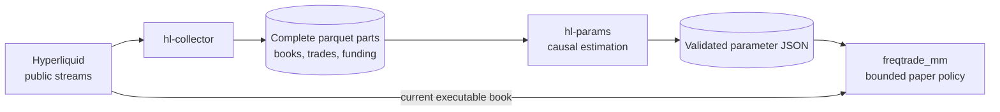

# Avellaneda–Stoikov Market Making

**An inventory-constrained research strategy for Hyperliquid perpetuals, running in Freqtrade.**

The bot alternates between flat and one long position. A public-data collector supplies order books, trades and funding observations; a separate process estimates the model inputs. The strategy and event replay share one quote implementation.

| Market | Execution | Stake | Leverage | Maximum hold | Trial drawdown stop |
| :--- | :--- | :--- | :--- | :--- | :--- |
| `PAXG/USDC:USDC` | Paper only | Up to 50 USDC | 1× | 30 minutes | **10 USDC** |

> [!IMPORTANT]
> This is an experiment, not a validated profitable strategy. Public trade crossings do not reveal our live queue position. The strategy refuses live mode, preserves its risk-stop state across restarts, and blocks entries when data or model inputs are invalid.

[Pipeline](#pipeline) · [Model](#model) · [Estimation](#estimation) · [Paper trial](#paper-trial) · [Validation](#validation) · [References](#references)

## Pipeline



| Component | Responsibility |
| :--- | :--- |
| `hl-collector` | Typed, atomic parquet publication; subscription health; market metadata and settled funding |
| `hl-params` | Five-second volatility forecasts, size-aware crossing calibration and an explicit validity gate |
| `freqtrade_mm` | Shared inventory policy, quantity/price checks, protective exits and persistent trial controls |
| `scripts/evaluate.py` | Chronological replay, execution/cost sensitivities and uncertainty reporting |

All three services use one project-owned image. The reference runtime is **Freqtrade 2025.10**, with **CCXT 4.5.84** pinned because the older connector cannot parse current Hyperliquid market metadata.

## Model

### Reference: the A–S approximation

For symmetric arrivals and unit lots, the classical approximate reservation price and half-spread are

$$
\begin{aligned}
r_t &= s_t-q_t\gamma\sigma_{\mathrm{abs}}^2(T-t),\\
h_t &= \frac{\gamma\sigma_{\mathrm{abs}}^2(T-t)}{2}
      +\frac{1}{\gamma}\ln\!\left(1+\frac{\gamma}{k}\right).
\end{aligned}
$$

Positive inventory lowers the reservation price. Setting inventory to zero while holding a long position removes that response. The implementation below uses an explicit constrained control problem rather than tuning an inventory-free spread.

### Implemented objective

The policy maximizes expected terminal liquidation wealth, with an inventory-risk penalty:

$$
\max_{\pi}\;
\mathbb{E}\!\left[
X_T+q_TS_T-C_{\mathrm{liq}}(q_T)
-\frac{\gamma_{\$}}{2}\int_t^T q_u^2v_u\,du
\right].
$$

| Symbol | Meaning | Units |
| :--- | :--- | :--- |
| $s_t,S_t$ | Top-of-book midpoint | USDC per base unit |
| $X_t$ | Cash-flow ledger, including fees and funding | USDC |
| $q_t$ | Actual inventory, including partial fills | Base units |
| $v_t$ | Forecast price-variance rate | Squared price units per second |
| $C_{\mathrm{liq}}$ | Spread/depth cost and taker fee of selling the remaining position | USDC |
| $\gamma_{\$}$ | Explicit risk preference | Inverse USDC |
| $\delta$ | Quote distance from the reference mid | Price units |
| $A,k$ | Crossing intensity scale and distance decay | Inverse seconds, inverse price units |

The initial research coefficient is $\gamma_{\$}=2\;\mathrm{USDC}^{-1}$. It is a declared experiment setting, not a fitted market property. Cash, quantity and price units are kept consistent when the stake or asset denomination changes.

A small backward dynamic program considers **wait, passive quote and liquidation** actions on a 15-second decision grid. A completed Freqtrade trade locks re-entry until the end of the current 15-minute candle. The planning horizon is 30 minutes; an existing position's deadline also counts down from its first fill.

The reference mid and arrival coefficients are frozen within each planning calculation. Forecast variance evolves through the horizon. A partial fill is managed using its actual remaining quantity. These are receding-horizon approximations, not a claim of exact optimality in a live queue.

## Estimation

### Volatility

Prices are sampled every five seconds using only books received before each sample. A book older than two seconds cannot supply a fresh observation. Missing intervals remain missing; returns never bridge gaps.

The primary estimator is a scaled Student-t GARCH(1,1). A fit is used only if optimization converges and its parameters and forecast variances are valid. Otherwise, a one-hour-half-life EWMA is used and identified explicitly in the output.

The model consumes cumulative forecast variance:

$$
V_t(h)=s_t^2\sum_{j=1}^{h/\Delta t}
\widehat{\operatorname{Var}}_t(r_{t+j}),
\qquad \Delta t=5\ \mathrm{s}.
$$

Daily-equivalent sigma is a reporting quantity. The stored forecast covers one hour so that a still-valid estimate can support a subsequent 30-minute planning horizon. Diagnostics include convergence, persistence, residual autocorrelation and the estimator/fallback reason.

### Size-aware crossing intensity

For every complete 15-second window, calibration measures the deepest quote crossed by enough recorded volume to fill the intended quantity. Trade fragmentation therefore does not create extra independent observations.

The fitted window-maximum distribution is

$$
P(D<d)=\exp\!\left[-A\Delta t\,e^{-kd}\right].
$$

An interval-censored likelihood counts each window once. Bid and ask fits are separate. Quotes are restricted to the empirically supported distance range; the outer boundary needs at least 20 supporting crossings. Optional uncertainty estimates use circular blocks of 120 accepted windows: nominally 30 minutes, longer when capture gaps have been excluded. The offline evaluator skips this intensity bootstrap during its repeated fits.

This estimates a **full-quantity public crossing proxy**. It does not estimate an authenticated order's queue position.

### Entry requirements

The default calculation uses a trailing 24-hour window and requires:

- At least six hours of data.
- At least 90% usable book and quote-exposure coverage.
- At least 1,000 exposure windows and 30 crossing windows per side.
- Known market precision/fees, recent funding context and healthy collection.
- Finite, correctly typed parameters and a valid UTC chronology.

A failed calculation publishes a disabled result. The bot rechecks inputs at entry confirmation; a missing or invalid update cannot leave a cached entry permission active.

Bad historical clocks are counted and excluded from usable observations and affected quote-exposure windows. They never become zero-crossing observations. The 90% coverage requirements still apply; an invalid latest book blocks entry.

There is **one current parameter format**, with no schema version or compatibility layer. Files are named `avellaneda_parameters_{TICKER}.json`. Valid historical parameter snapshots and timestamped market metadata are retained for chronological research.

`data_valid` describes input/model validity. `trade_enabled` additionally requires accepted historical evidence. The isolated trial explicitly enables `paper_evaluation`: simulated entries may be studied while profitability remains inconclusive, but data checks and risk stops cannot be bypassed.

## Paper trial

### Controls

| Control | Behaviour |
| :--- | :--- |
| Position stop | Exit at a net liquidation loss of 1% of filled entry notional |
| Holding deadline | Exit after 30 minutes from the first fill |
| Drawdown stop | Cancel entries and flatten at 10 USDC below observed peak liquidation equity |
| Trial duration | Seven days after valid data/model warm-up |
| Restart | Restore the deadline, peak equity and stop latch; never reset accumulated losses |
| Invalid data | Block entries and continue protective position management |

These are trigger thresholds, not guaranteed execution bounds. Outages, gaps and execution delay can cause overshoot.

Normal orders are GTC; the adapter does not guarantee post-only execution. Native price-stop/emergency orders use market execution. Net-loss, deadline and drawdown exits use aggressive reduce-only limits at executable bid depth, then continue managing any residual.

The shared policy defaults are defined in `scripts/quote_model.py`. Changing experiment settings requires reevaluation; the 50-USDC stake must also match `stake_amount` in the Freqtrade configuration.

### Start

Create a gitignored `.env` with fresh API-server credentials:

```dotenv
FREQTRADE__API_SERVER__USERNAME=<user>
FREQTRADE__API_SERVER__PASSWORD=<non-numeric-password>
FREQTRADE__API_SERVER__JWT_SECRET_KEY=<new-random-secret>
```

Then run from the repository root:

```bash
docker compose -p avellaneda-paper -f docker-compose.yml -f compose.paper.yml config --quiet
docker compose -p avellaneda-paper -f docker-compose.yml -f compose.paper.yml build freqtrade_mm
docker compose -p avellaneda-paper -f docker-compose.yml -f compose.paper.yml up -d
docker compose -p avellaneda-paper -f docker-compose.yml -f compose.paper.yml logs -f
```

The API is bound to **127.0.0.1:3004**. Runtime files are isolated under `runtime/paper/`:

```text
runtime/paper/
├── market-data/       # Public capture, metadata and collector health
├── params/            # Current results and valid historical snapshots
└── state/             # Paper database, trial.json and Freqtrade logs
```

`trial.json` reports the current state and blocking reason. `waiting_for_valid_data` is expected during warm-up. An elapsed six hours alone does not authorize an entry: coverage, crossing counts, model validity and the chosen action must also qualify.

Read Freqtrade's native PnL summary using the bot's existing API credentials:

```bash
docker compose -p avellaneda-paper -f docker-compose.yml -f compose.paper.yml exec -T freqtrade_mm python /freqtrade/scripts/show_pnl.py
```

These framework metrics differ from the executable liquidation equity used by the risk stop in `trial.json`.

The collector uses Hyperliquid's **fast five-level book stream**. A local probe measured approximately 0.55 seconds between fast snapshots versus 5.22 seconds for the default twenty-level stream. These measurements describe that probe, not a latency guarantee.

The paper Compose override is separate from the default `runtime/main/` paths. Existing historical databases are not reused or reset. CPU and API-rate limits on a shared host remain managed by the workspace's central tooling.

### Connection loss and PC restarts

The collector reconnects and resubscribes after disconnects or stalled feeds. Connections use a ten-second socket timeout; retries back off from two to thirty seconds. Fresh observations and subscription acknowledgements are required after each reconnection. Failed parameter calculations retry after one minute; valid estimates retain the fifteen-minute schedule.

Docker's `unless-stopped` policy restores the services when its engine restarts. On Windows, enable [Start Docker Desktop when you sign in](https://docs.docker.com/desktop/settings-and-maintenance/settings/); recovery then occurs after Windows sign-in, not before it. Containers deliberately stopped with `docker compose stop` remain stopped until started again.

SQLite trades/orders, first-fill deadlines, trial start, peak equity and stop latches survive in `runtime/paper/state/`. Restarting does not grant a new risk budget or holding period. Graceful shutdown flushes capture buffers; an abrupt crash can lose the unpublished batch (normally up to five minutes). Incomplete temporary files are ignored, and missing intervals remain gaps subject to the coverage checks.

## Validation

Run the focused checks in the same image:

```bash
docker compose -p avellaneda-paper -f docker-compose.yml -f compose.paper.yml \
  run --rm --no-deps --entrypoint python hl-params /freqtrade/scripts/check_pipeline.py
```

Checks include synthetic parameter recovery, future-data invariance, failed GARCH fits, an independently enumerated small control problem, denomination scaling, Freqtrade's candle lock, partial fills, cancellation races, terminal losses, rejected parameter updates, persistent stops, SQLite order/deadline restoration, reconnects and parquet failure recovery.

For a diagnostic calculation, write to a separate directory so it cannot race the running parameter service:

```bash
docker compose -p avellaneda-paper -f docker-compose.yml -f compose.paper.yml \
  run --rm --no-deps --entrypoint python hl-params \
  /freqtrade/scripts/calculate_avellaneda_parameters.py PAXG --output-dir /freqtrade/params/diagnostics
```

`scripts/verify_effective_price.py` reads a captured book file or parquet directory through the production loader and summarizes bid, ask and midpoint prices; `--start` and `--end` accept timezone-aware timestamps.

For a chronological replay, replace the example dates with an interval having a preceding calibration history:

```bash
docker compose -p avellaneda-paper -f docker-compose.yml -f compose.paper.yml \
  run --rm --no-deps --entrypoint python hl-params \
  /freqtrade/scripts/evaluate.py PAXG --data-dir /freqtrade/market-data \
  --start 2026-10-03T00:00:00Z --end 2026-10-10T00:00:00Z \
  --output /freqtrade/params/evaluation
```

The evaluator refits using preceding observations, liquidates at daily boundaries, and reports base/zero/five-second latency cases, higher fees, all-taker costs, a fixed-quote baseline and no trading. Each day resets inventory and simulated risk state; the paper run tracks the continuous seven-day budget. The evaluator saves JSON ledgers, an evidence summary and a diagnostic figure.

The normal evidence gate requires seven complete out-of-sample days, 100 completed round trips and positive one-sided 95% block-bootstrap lower bounds for base and five-second latency scenarios. Two-day-block sensitivity must also remain positive. Missing observations or insufficient samples remain **inconclusive**.

### Remaining scientific limits

- Public-trade replay and Freqtrade dry-run have different fill mechanisms. Neither validates live queue position.
- The binary full-fill arrival model approximates a market with partial execution; the ledger still accounts for actual simulated partial quantities.
- A finite, fixed reference price within the control calculation omits predictive drift and explicit adverse-selection dynamics. Post-fill markouts are recorded to test that assumption.
- Funding marks use the observed mark when available, otherwise the contemporaneous book midpoint as a valuation proxy.
- Quote search is capped at 512 tick candidates for unusually wide fitted ranges.
- Synthetic agreement, a healthy process or a short positive run does not establish a trading edge.

## References

| Resource | Relevant material |
| :--- | :--- |
| [Avellaneda & Stoikov (2008)](https://math.nyu.edu/inmemoriam/avellaneda/HighFrequencyTrading.pdf) | Reservation prices and approximate spreads |
| [Guéant, Lehalle & Fernandez-Tapia](https://arxiv.org/abs/1105.3115) | Inventory constraints and finite-horizon control |
| Cartea, Jaimungal & Penalva, *Algorithmic and High-Frequency Trading*, Chapter 10 | Running inventory penalties, liquidation and adverse selection |
| López de Prado, *Advances in Financial Machine Learning*, Chapters 7, 11 and 12 | Leakage, selection bias and chronological evaluation |
| Jansen, *Machine Learning for Algorithmic Trading*, Chapter 9 | Volatility modelling and residual/forecast diagnostics |
| [Hyperliquid fees](https://hyperliquid.gitbook.io/hyperliquid-docs/trading/fees) and [funding](https://hyperliquid.gitbook.io/hyperliquid-docs/trading/funding) | Cost assumptions |

The [Francesco Mangia notebook](scripts/Francesco_Mangia_Avellaneda_BTC.ipynb) is retained as a historical reference with its original code and notes. It uses external datasets and different execution assumptions; its conclusions are not validation of this implementation. Cached execution outputs have been removed.

## Support

[Hyperliquid referral link](https://app.hyperliquid.xyz/join/FREQTRADE) — supports the project; current eligibility and discounts follow Hyperliquid's terms.

## Disclaimer

This project is for research and education. Market making can lose money through price moves, adverse selection, costs and execution failures. Historical and synthetic results do not establish future profitability.
